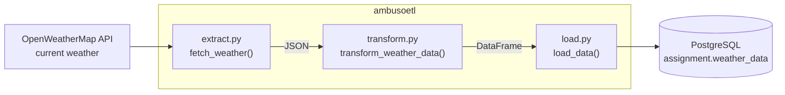

# ambusoetl

A small Python ETL package that fetches the current weather for a city from the OpenWeatherMap API and loads it into PostgreSQL.

## Architecture



## How it works

1. **Extract** (`extract.py`): calls the OpenWeatherMap current weather endpoint for one city, in metric units, and returns the JSON response.
2. **Transform** (`transform.py`): keeps the city, temperature, description and humidity, and returns them as a one-row pandas DataFrame.
3. **Load** (`load.py`): creates the `assignment` schema and `weather_data` table if they are missing, then inserts the row.

`main.py` is the same pipeline written as a single script.

## Install

```bash
git clone https://github.com/Ambuso/ambusoetl.git
cd ambusoetl
pip install . python-dotenv
```

Create a `.env` file in the folder you run from:

```
API_KEY=your_openweathermap_api_key
api_key=your_openweathermap_api_key
CITY_NAME=Nairobi

DB_NAME=your_database
DB_HOST=your_host
DB_USER=your_user
DB_PASSWORD=your_password
DB_PORT=5432
```

The key is listed twice because `main.py` reads `API_KEY` and `extract.py` reads `api_key`. `CITY_NAME` is optional and defaults to Nairobi.

## Use it

As a package:

```python
from ambusoetl.extract import fetch_weather
from ambusoetl.transform import transform_weather_data
from ambusoetl.load import load_data

load_data(transform_weather_data(fetch_weather()))
```

Or as a single script:

```bash
python -m ambusoetl.main
```

## Output table

`assignment.weather_data`

| Column | Type | Meaning |
|---|---|---|
| id | serial | Primary key |
| city | text | City name |
| temperature | float | Temperature in Celsius |
| description | text | Weather description |
| humidity | int | Humidity in percent |

## Files

```
ambusoetl/extract.py     API request
ambusoetl/transform.py   JSON to DataFrame
ambusoetl/load.py        DataFrame to PostgreSQL
ambusoetl/main.py        The whole pipeline as one script
pyproject.toml           Package definition
```

## Built with

Python, requests, pandas, psycopg2, PostgreSQL

## License

MIT
